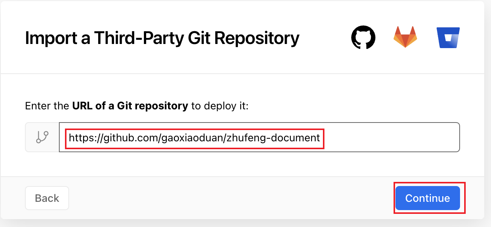
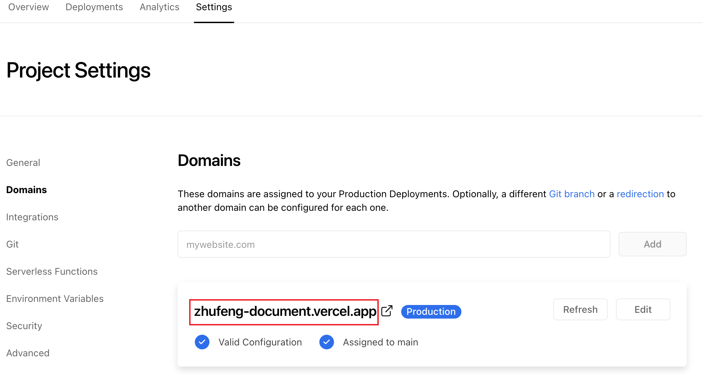

# zhufengDocument

文档地址：https://zhufeng-document.vercel.app/
## 项目说明：
本项目仅用于 **个人学习** 如有侵权，请联系作者删除

## 运行方式：
- 克隆仓库 `git clone https://github.com/gaoxiaoduan/zhufeng-document.git`
- 进入项目文件夹 `cd zhufeng-document`
- 安装依赖 `npm install`
- 运行项目 `npm start`


```bash
Vercel CLI 24.0.0
> Ready! Available at http://localhost:3000
```

运行成功🎉

## Vercel 部署
项目中已经添加了 Vercel 配置文件,可以直接在 Vercel 下部署了,不需要自己的服务器

[](https://vercel.com/import/project?template=https://github.com/gaoxiaoduan/zhufeng-document)

<details>
 <summary>部署 Vercel 的指导</summary>

1. 前往 [vercel.com](https://vercel.com/)

1. 点击 `Log in`
   

1. 点击 `Continue with GitHub` 通过 GitHub 进行登录
   

1. 登录 GitHub 并允许访问所有存储库（如果系统这样提示）

1. Fork 这个仓库

1. 返回到你的 [Vercel dashboard](https://vercel.com/dashboard)

1. 选择 `Import Project`
   

1. 选择 `Import Git Repository`
   

1. `PROJECT NAME`自己填,`FRAMEWORK PRESET` 选 `Other`

1. 然后点击 `deploy`，等待部署完成，点击你的域名即可查看
   
   </details>
